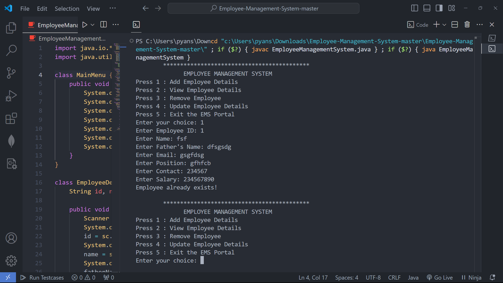

# Employee Management System

This repository contains a **Java-based Employee Management System** implemented as a **Text-based User Interface (TUI)** program. The system provides the following core operations:

1. **Add Employee**  
2. **Remove Employee**  
3. **Update Employee Details**  
4. **View Employee Details**

The program is designed using **Object-Oriented Programming (OOP) concepts**, ensuring modularity, readability, and reusability.

---

## Features:
- **Add Employee**: Capture and store employee details in a structured manner.
- **Remove Employee**: Delete employee records with a unique employee ID.
- **Update Employee**: Modify specific details of an employee.
- **View Details**: Retrieve and display stored employee information.

---

## How to Run?

1. **Compile the Program**:  
   ```bash
   javac EmployManagementSystem.java
   java EmployManagementSystem





